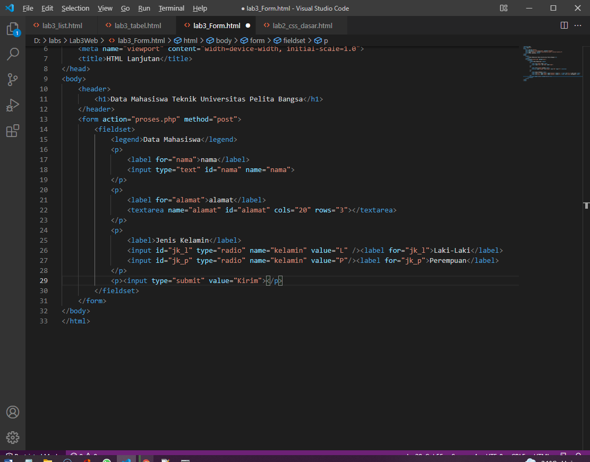
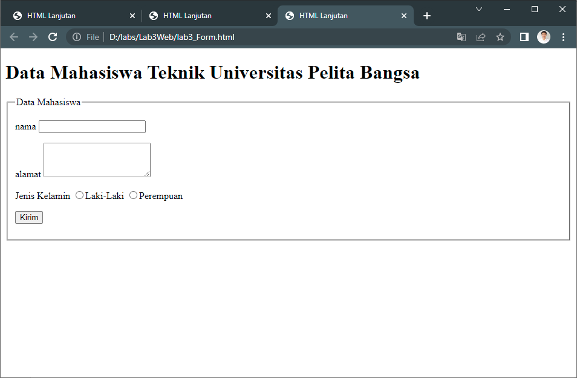
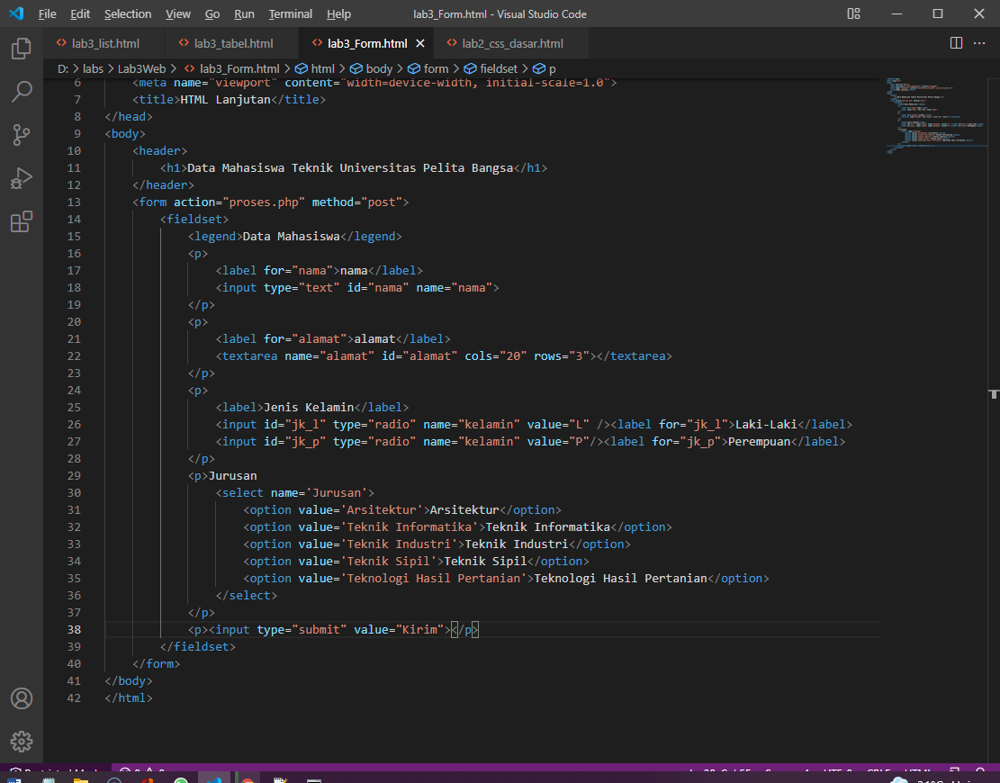
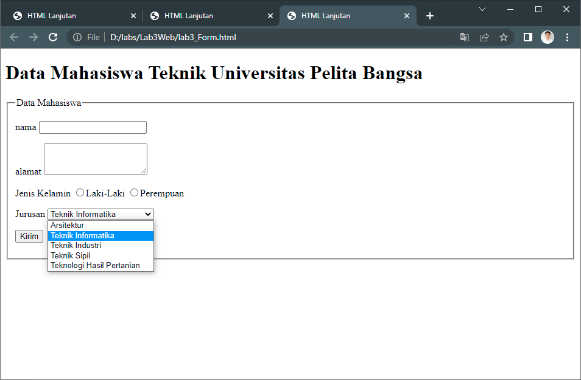
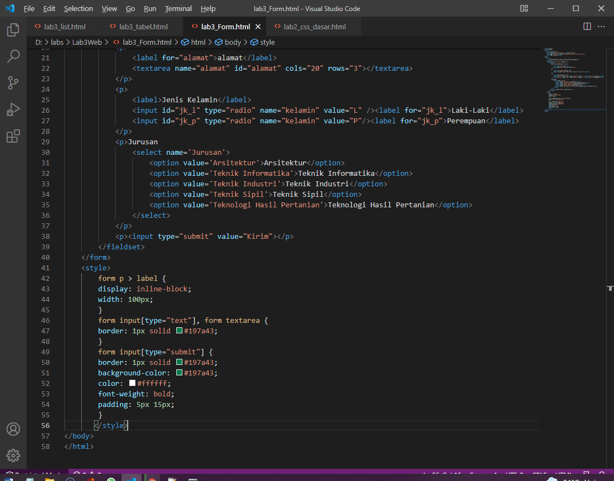
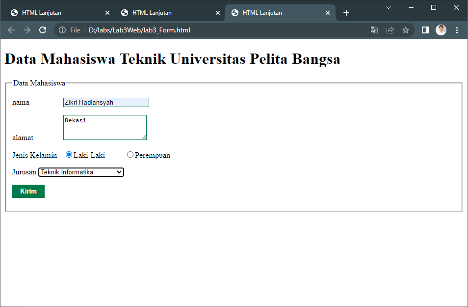

# Tugas
* buatlah Form yang menampilkan dropdown menu dan listbox dengan multiple selection

## Jawaban

* Berikut Merupakan Deklarasi untuk membuat basic Form :

* Tampilan Browsernya :

* Memasukan Deklarasi agar terdapat dropdown menu :

* Tampilan Browsernya :

* ditambahkan Deklarasi style pada Form :

* Tampilan Browsernya :
